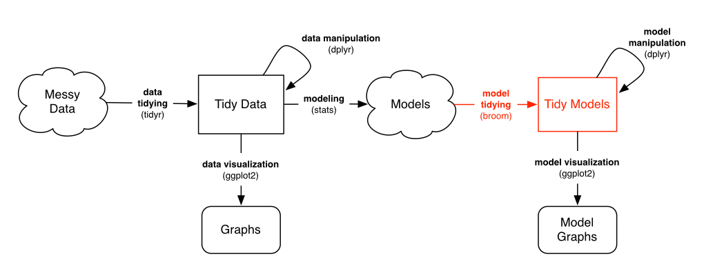
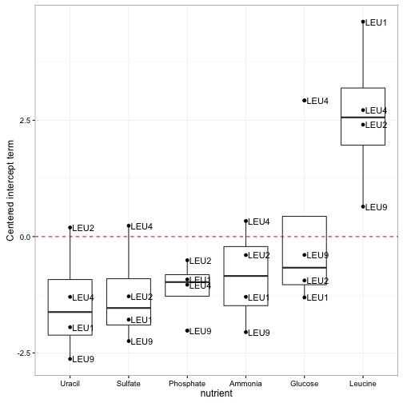

```{r setup, include=FALSE}
knitr::opts_chunk$set(echo = T)
```

Previously in the [Cleaning](http://rpubs.com/edwardhust/245873) post, the another post codes from [David Robinson](http://varianceexplained.org/r/tidy-genomics-broom/). It's a bioinformatician and computational biologist beginner learnning series. I Learne how to use [tidyverse](https://github.com/tidyverse/tidyverse) suites to tidy messy data. The paper composed by Hadley is linked on the previous post.

Here I'll show how to use dplyr to fit linear models to each gene-nutrient combination, while using [broom](https://github.com/tidyverse/broom) package to recombine these models so that we can keep working with the same tidy tools.

```{r libraries}
suppressMessages(require(tidyverse))
suppressMessages(require(stringr))
```

## Clean data

```{r clean data}
original_data <- read_tsv('Brauer2008_DataSet1.tds')
nutrient_names <- c(G = "Glucose", L = "Leucine", P = "Phosphate",S = "Sulfate", N = "Ammonia", U = "Uracil")
cleaned_data <- original_data %>%
  separate(NAME, c("name", "BP", "MF", "systematic_name", "number"), sep = "\\|\\|") %>%
  mutate_each(funs(trimws), name:systematic_name) %>%
  select(-number, -GID, -YORF, -GWEIGHT) %>%
  gather(sample, expression, G0.05:U0.3) %>%
  separate(sample, c("nutrient", "rate"), sep = 1, convert = TRUE) %>%
  mutate(nutrient = plyr::revalue(nutrient, nutrient_names)) %>%
  filter(!is.na(expression), systematic_name != "")
```

## Visualization
```{r visualization}
cleaned_data %>%
  filter(BP == "leucine biosynthesis") %>%
  ggplot(aes(rate, expression, color = nutrient)) +
  geom_point() + 
  geom_smooth(method = "lm", se = F) +
  facet_wrap(~name + systematic_name)

# wrap ggplot into function
plot_expression_data <- function(expression_data){
  ggplot(expression_data, aes(rate, expression, color = nutrient)) +
    geom_point() + 
    geom_smooth(method = "lm", se = F) + 
    facet_wrap(~name + systematic_name, scales = "free_y")
}

cleaned_data %>% 
  filter(BP == "leucine biosynthesis") %>%
  plot_expression_data()

# This is a great way to visualize a few genes at a time. But there are so many genes in the dataset. For example, let’s instead filter by the biological process cell wall organization and biogenesis.

cleaned_data %>%
  filter(BP == "cell wall organization and biogenesis") %>%
  plot_expression_data()

# that's  36 genes and it’s already getting a lot harder to understand these plots. And we have 5500 genes in this dataset: no way can we visually interpret all those genes at once. This is where we introduce modeling.
```

## Linear Regressions

Let’s look back at one of our notable genes: LEU1 under leucine starvation.
```{r}
LEU1_leucine <- cleaned_data %>%
  filter(name == "LEU1", nutrient == "Leucine")

ggplot(LEU1_leucine, aes(rate, expression)) +
  geom_point()
```

Statisticians have a pretty good idea how we to see if this trend is statistically significant: linear regression.
```{r}
mod <- lm(expression ~ rate, LEU1_leucine)
summary(mod)

```
It looks like this tread is significant (p-value 0.003564).

**We could do this one at a time for each gene/nutrient combination. But really we want to apply it to every combination of a gene and a nutrient.1 This is a problem, because that lm object isn’t designed for recombining. It contains many components of varying shapes: residuals, fitted values, an F-statistic, and so on. Having a list of those objects isn’t going to work with dplyr or with ggplot2: it would take us out of the tidy data framework.**

This is where we bring in my broom package, which is designed for this very purpose: **turning model objects into data frames**. This lets us work with the outputs of models-graphing, sorting and summarizing them-using the same tidy tools we used to process our data.


```{r}
suppressMessages(require(broom))
tidy(mod)
```

Notice that it has the same information as `coef(summary(mod))`: slope estimate, standard error, t-statistic, and p-value for each coefficient. But now it’s in a data frame, rather than a matrix, and the rownames have been moved into a column of the data frame. 

This lets us **combine multiple models**, which in turn lets us perform the modeling within a do statement.
```{r}
linear_models <- cleaned_data %>%
  group_by(name, systematic_name, nutrient) %>%
  do(tidy(lm(expression ~ rate, .)))

linear_models
```

Notice that there are two rows for each gene-nutrient combination: an intercept and a slope term. (You can read more about using broom and dplyr together in this vignette). This is simplifying each gene-nutrient combination into two values:

- **Intercept: **How highly expressed the gene is when it’s starved of that nutrient.
- **rate: **How much the gene’s expression responds to an increasing supply of that nutrient (and therfore an increasing growth rate)

### Intercept terms
```{r}
intercept_terms <- linear_models %>%
  ungroup() %>%
  filter(term == "(Intercept)")
intercept_terms
```
The p-values aren’t actually interesting to us here: they’re testing whether the intercept is equal to 0, which is not a particularly special number in terms of these normalized gene expressions. (Confidence intervals and standard errors would be, which I may discuss in a future post).

What we’re really interested in is the value of each intercept relative to the other nutrients in that gene. For example, let’s again consider our favorite gene, LEU1.

We could do this by centering the intercepts around the average for each gene, using a group_by and mutate:

```{r}
centered_intercepts <- intercept_terms %>%
  group_by(systematic_name) %>%
  mutate(centered_intercept = estimate - mean(estimate)) %>%
  ungroup()

# Now we are interested in the most extreme cases, where the intercept is very far from the other nutrients. The top_n function is useful for this.

top_intercept <- centered_intercepts %>%
  top_n(20, centered_intercept)

```

Note that here I’m looking for cases where a single nutrient was greatly overexpressed in starvation (to look for underexpressed nutrients, we could have used -centered_intercept instead). We can then pull these genes out of the original data with the useful semi_join, at which point we can graph it with our plot_expression_data:

```{r}
cleaned_data %>%
  semi_join(top_intercept, by = "systematic_name") %>%
  plot_expression_data()
```

These certainly do look like interesting genes! We notice that some genes, like PHO11, only one nutrient is highly expressed while the rest show low expression, while other genes, such as ADH2, show varying levels of expression for each nutrient. We also notice that in most cases the highly expressed nutrient is moving back down towards the others as growth rate increases (that is, as the yeast is less starved). This makes sense, since it’s the starvation that is eliciting the unusual behavior.

What do these genes do? Beats me; I’m not a biologist, I just play one on my degree. But it certainly looks promising that PHO11, PHO12. and PHO5 are both much higher expressed when phosphorus is the limiting nutrient, as well as SUL1 when sulfur is rare- and indeed each gene is involved in transport of that nutrient. (And we do see our Gene of the Week, LEU1).

### Slope terms

Now let’s take a look at the slope terms, which shows whether each gene increased or decreased its growth rate in a particular condition.

```{r}
slope_terms <- linear_models %>%
  ungroup() %>%
  filter(term == "rate", !is.na(p.value))

#Here, we’ll focus a bit more on statistical significance. First we can make a histogram of the p-values. These p-values are spread across six different nutrients, so we’ll facet our histogram by those nutrients:
ggplot(slope_terms, aes(p.value)) +
  geom_histogram(binwidth = 0.5) + 
  facet_wrap(~nutrient)
```

[See here for my guide on interpreting this kind of p-value histogram](http://varianceexplained.org/statistics/interpreting-pvalue-histogram/). In this case, we can see that the tests are generally well-behaved, with a mix of nulls (genes that don’t respond to growth rate) and alternatives (genes that do). Thus, we can use p-value correction to identify significant genes. Since we have a lot of hypotheses, it’s a good idea to use the [Story q-value](http://www.pnas.org/content/100/16/9440.full).

```{r}
# see https://bioconductor.org/packages/release/bioc/html/qvalue.html
# for installation instructions
require(qvalue)
slope_terms <- slope_terms %>%
  mutate(q.value = qvalue(p.value)$qvalues)
slope_terms
```

(I talk a bit about FDR and q-value from a Bayesian perspective [here](http://varianceexplained.org/r/bayesian_fdr_baseball/)).

Now that we have a measure of significance, we can ask all sorts of questions. We could ask which nutrients have the most genes significantly correlated with expression (at a 1% FDR):
```{r}
slope_terms %>%
  group_by(nutrient) %>%
  summarise(significant = sum(q.value < 0.01)) %>%
  arrange(-significant)
```

Here’s an interesting question: are there any cases where the gene is significantly positively correlated with growth rate in one limiting nutrient, and significantly negatively correlated in another? We can discover this with a group_by and filter:

```{r}
diff_direction_genes <- slope_terms %>%
  filter(q.value < 0.01) %>%
  group_by(systematic_name) %>%
  filter(any(estimate > 0) & any(estimate < 0))

cleaned_data %>% semi_join(diff_direction_genes, by = "systematic_name") %>%
  plot_expression_data()
```

Those certainly look like genes worthy of further study. But you may be interested in different phenomena when you’re analyzing your data- you might want cases where expression responds to glucose, but no other conditions. This tidy setup of the models makes it easy to answer these questions in an interactive and exploratory way.

> Visualization can surprise you, but it doesn’t scale well.  Modeling scales well, but it can’t surprise you.

When we chose to model gene expression with linear regression, we made a strong assumption: that we could represent each gene’s trend using a linear regression within each gene/nutrient combination. We couldn’t do that if we’d noticed some genes had a non-linear trend- something like this:

That’s why I always recommend looking at small subsets first, like a single gene or biological process.

If we’d seen any genes that had this kind of expression profile, we’d have known to choose a different approach. It’s still possible there are weird genes like this! If they are, our regressions would not find them, because our model will never surprise us. [There’s no free lunch](http://varianceexplained.org/r/kmeans-free-lunch/)

## Next time
Earlier in this post I showed the expression of four genes involved in “leucine biosynthesis”. Now that we have our per-gene-per-nutrient linear model, here’s another way we can look at them:


Notice how clear it is that these genes respond to leucine starvation in particular. Unlike the earlier visualization, this can be applied to gene sets containing dozens or even hundreds of genes while still making the general trend apparent. Furthermore, we could use these summaries to look at many gene sets at once, and even use statistical tests to discover new gene sets that respond to starvation.

Thus, in my next post in this series, we’ll apply our “tidy modeling” approach to a new problem. Instead of testing whether each gene responds to starvation in an interesting way, we’ll test functional groups of genes in order to find higher-level biological insights. And we’ll do it with these same set of tidy tools we’ve been using so far.

[Next Post](http://varianceexplained.org/r/tidy-genomics-biobroom/)