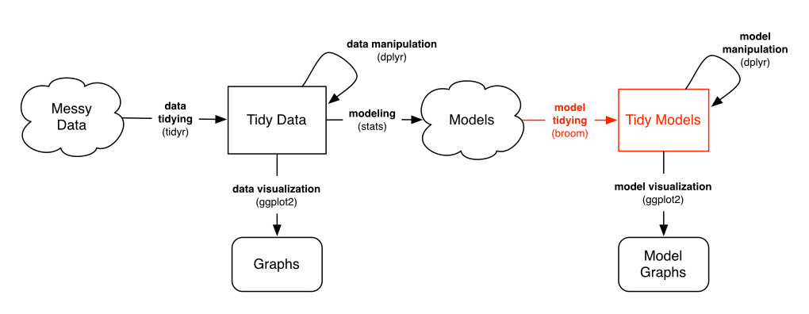

```{r setup, include=FALSE}
knitr::opts_chunk$set(echo = T)
```

# Case study in tidy analysis 

## Brief Info
The case study in tidy analysis sereis Including these three posts:

+ [Cleaning and visualizing genomic data: a case study in tidy analysis](http://varianceexplained.org/r/tidy-genomics/)
+ [Modeling gene expression with broom: a case study in tidy analysis](http://varianceexplained.org/r/tidy-genomics-broom/)
+ [Tidying computational biology models with biobroom: a case study in tidy analysis](http://varianceexplained.org/r/tidy-genomics-biobroom/)

I try to rewrite and run the codes step by step to learn the research pattern of gene expression.

The first impression of the post series is **R or tidyverse** can handle big matrix like MySQL. But, it's bueatiful and elegant than MySQL.

The next imporession is the pciture below.


This picture explain the general pattern of data science. The tidy package suits is based on the [Hardley paper](http://vita.had.co.nz/papers/tidy-data.pdf). The tidy packages open the door for beginners to use R easily. The base R is very tedious fussy that newbie won't use R. The tidy packages significantly improve the convenience of analysis data. Keep in mind the tidy data principle:

1. Each variable forms a column.
2. Each observation forms a row.
3. Each type of observational unit forms a table.

This is third post from [Robinson](http://varianceexplained.org/r/tidy-genomics-biobroom/)

From the posts so far, one might get the impression that I think data must be tidy at every stage of an analysis. Not true! That would be an absurd and unnecessary constraint. Lots of mathematical operations are faster on matrices, such as singular value decomposition or linear regression. Jeff Leek rightfully points this out as an issue with my previous modeling gene expression post, where he remarks that the limma package is both faster and takes more statistical considerations (pooling variances among genes) into account.

As long as you’re in that Models “cloud”, you can store your data in whatever way is computationally and practically easiest. However:

+ Before you model, you should use tidy tools to clean, process and wrangle your data (as shown in previous posts)
+ After you’ve performed your modeling, you should turn the model into a tidy output for interpretation, visualization, and communication

This requires a new and important tool in our series on tidy bioinformatics analysis: the [biobroom package](http://bioconductor.org/packages/release/bioc/html/biobroom.html) In this post I’ll show how to use the limma and biobroom packages in combination to continue a tidy analysis, and consider when and how to use non-tidy data in an analysis.

## Setup
```{r}
suppressMessages(require(tidyverse))
suppressMessages(require(stringr))

nutrient_names <- c(G = "Glucose", L = "Leucine", P = "Phosphate",S = "Sulfate", N = "Ammonia", U = "Uracil")

cleaned_data <- read_tsv('Brauer2008_DataSet1.tds') %>%
  separate(NAME, c("name", "BP", "MF", "systematic_name", "number"), sep = "\\|\\|") %>%
  mutate_each(funs(trimws), name:systematic_name) %>%
  select(-number, -GID, -YORF, -GWEIGHT) %>%
  gather(sample, expression, G0.05:U0.3) %>%
  separate(sample, c("nutrient", "rate"), sep = 1, convert = TRUE) %>%
  mutate(nutrient = plyr::revalue(nutrient, nutrient_names)) %>%
  filter(!is.na(expression), systematic_name != "") %>%
  group_by(systematic_name, nutrient) %>%
  filter(n() == 6) %>%
  ungroup()

suppressMessages(require(broom))

linear_models <- cleaned_data %>%
  group_by(name, systematic_name, nutrient) %>%
  do(tidy(lm(expression ~ rate, .)))

```
The above approach is useful and flexible. But as [Jeff notes](http://simplystatistics.org/2016/02/17/non-tidy-data/), it’s not how a computational biologist would typically run a gene expression analysis, for two reasons.

+ Performing thousands of linear regressions with separate lm calls is slow. It takes about a minute on my computer. There are computational shortcuts we can take when all of our data is in the form of a gene-by-sample matrix.
+ We’re not taking statistical advantage of the shared information. Modern bioinformatics approaches often “share power” across genes, by pooling variance estimates. The approach in the limma package is one notable example for microarray data, and RNA-Seq tools like edgeR and DESeq2 take a similar approach in their negative binomial models.

We’d like to take advantage of the sophisticated biological modeling tools in Bioconductor. We’re thus going to convert our data into a non-tidy format (a gene by sample matrix), and run it through limma to create a linear model for each gene. Then when we want to visualize, compare, or otherwise manipulate our models, we’ll tidy the model output using biobroom.

## Limma
Most gene expression packages in Bioconductor expect data to be in a matrix with one row per gene and one column per sample. In the last post we fit one model for each gene and nutrient combination. So let’s set it up that way using reshape2’s `acast`

```{r}
suppressMessages(require(reshape2))
exprs <- acast(cleaned_data, systematic_name + nutrient ~ rate, value.var = "expression")

head(exprs)

# We then need to extract the experiment design, which in this case is just the growth rate:
rate <- as.numeric(colnames(exprs))
```
[limma](https://bioconductor.org/packages/release/bioc/html/limma.html) (“linear modeling of microarrays”) is one of the most popular Bioconductor packages for performing linear-model based differential expression analyses on microarray data. With the data in this matrix form, we’re ready to use it:
```{r}
suppressMessages(require(limma))
fit <- lmFit(exprs, model.matrix(~rate))
eb <- eBayes(fit)

# This performs a linear regression for each gene. This operation is both faster and more statistically sophisticated than our original use of lm for each gene.
summary(eb)

# That’s a lot of outputs, and many of them are matrices of varying shapes. If you want to work with this using tidy tools (and if you’ve been listening, you hopefully do), we need to tidy it:

suppressMessages(require(biobroom))
tidy(eb, intercept = TRUE)

# Notice that this is now in one-row-per-coefficient-per-gene form, much like the output of broom’s tidy() on linear models.

# Like broom, biobroom always returns a table without rownames that we can feed into standard tidy tools like dplyr and ggplot2. (Note that unlike broom, biobroom requires an intercept = TRUE argument to leave the intercept term, simply because in many genomic datasets- though not ours- the intercept term is almost meaningless). biobroom can also tidy model objects from other tools like edgeR or DESeq2, always giving a consistent format similar to this one.

# Now all we’ve got to do split the systematic name and nutrient back up. tidyr’s separate() can do this:
td <- tidy(eb, intercept = TRUE) %>%
  separate(gene, c("systematic_name", "nutrient"), sep = "_")

td
```

### Analyzing a tidied model

We can now use the tidy approaches to visualization and interpretation that were explored in previous posts. We could create a p-value histogram

```{r}
ggplot(td, aes(p.value)) +
  geom_histogram() +
  facet_grid(term ~ nutrient, scales = "free_y")

# Or make a volcano plot, comparing statistical significance to effect size (here let’s say just on the slope terms):

td %>%
  filter(term == "rate") %>%
  ggplot(aes(estimate, p.value)) +
  geom_point() +
  facet_wrap(~ nutrient, scales = "free") +
  scale_y_log10() 

# We could easily perform for multiple hypothesis testing within each group, and filter for significant (say, FDR < 1%) changes:

td_filtered <- td %>%
  group_by(term, nutrient) %>%
  mutate(fdr = p.adjust(p.value, method = "fdr")) %>%
  ungroup() %>%
  filter(fdr < .01)

# Or finding the top few significant changes in each group using dplyr’s top_n:
top_3 <- td_filtered %>%
  filter(term == "rate") %>%
  group_by(nutrient) %>%
  top_n(3, abs(estimate))

top_3

# We could join this with our original data, which would let us visualize the trends for only the most significant genes:

top_3 %>%
  rename(significant_nutrient = nutrient) %>%
  inner_join(cleaned_data, by = "systematic_name") %>%
  mutate(highlight = nutrient == significant_nutrient) %>%
  ggplot(aes(rate, expression, color = nutrient)) +
  geom_point() +
  geom_smooth(aes(lty = !highlight), method = "lm", se = FALSE, show.legend = FALSE) +
  facet_wrap(significant_nutrient ~ systematic_name, ncol = 3, scales = "free_y")
```


In short, you can once again use the suite of “tidy tools” that we’ve found powerful in genomic analyses.

**Conclusion: Data is wrangled for you, not you for the data**

There’s a classic proverb of computer science from Abelman & Sussman: “Programs must be written for people to read, and only incidentally for machines to execute.” I’d say this is even more true for data it is for code. Data scientists need to be very comfortable engaging with their data, not fighting with the representation.

I agree with a lot in Jeff’s “Non-tidy data” post, but there’s one specific statement I disagree with:

>…you might not use tidy data because many functions require a different, also very clean and useful data format, and you don’t want to have to constantly be switching back and forth.

**I’d counter that switching is a small cost, because switching can be automated. Note that in the above analysis, reshaping the data required only two lines of code and two functions (acast() and tidy()). In contrast, there’s no way to automate critical thinking. Any challenge in plotting, filtering, or merging your data will get directly in the way of answering scientific questions.**

It’s thus the job of tool developers to make these “switches” as easy as possible. broom and biobroom play a role in this, as do reshape2 and tidyr.

## Next time: gene set enrichment analysis
These per-gene models can still be difficult to interpret biologically if you’re not familiar with the functions of specific genes. What we really want is a way to summarize the results into “genes involved in this biological process changed their expression.” This is where annotations of gene sets become useful.

```{r}
gene_sets <- distinct(cleaned_data, systematic_name, BP, MF)

td %>%
  inner_join(gene_sets, by = "systematic_name") %>%
  filter(BP == "leucine biosynthesis", term == "(Intercept)") %>%
  mutate(nutrient = reorder(nutrient, estimate, median)) %>%
  ggplot(aes(nutrient, estimate)) +
  geom_boxplot() +
  geom_point() +
  geom_text(aes(label = systematic_name), vjust = 1, hjust = 1) +
  xlab("Limiting nutrient") +
  ylab("Intercept (expression at low concentration)") +
  ggtitle("Genes involved in leucine biosynthesis")
```


Notice how clear it is that these genes respond to leucine starvation in particular. This can be applied to gene sets containing dozens or even hundreds of genes while still making the general trend apparent. Furthermore, we could use these summaries to look at many gene sets at once, and even use statistical tests to discover new gene sets that respond to starvation.

Thus, in next post in this series, we’ll apply our “tidy modeling” approach to a new problem. Instead of testing whether each gene responds to starvation in an interesting way, we’ll test functional groups of genes (a general method called [gene set analysis](http://www.nature.com/nrg/journal/v17/n6/full/nrg.2016.29.html)) in order to develop higher-level biological insights. And we’ll do it with these same set of tidy tools we’ve been using so far.


