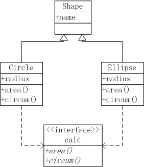
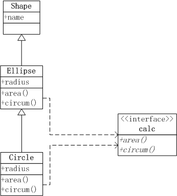

```{r}
library(pryr)

setClass('Person', slots = list(name = 'character', age = 'numeric'))

father <- new("Person", name = "F", age = 44)
father
class(father)
otype(father)

# inherit Class Person

# contains argument is to inherit class
setClass('Son', slots = list(father = 'Person', mother = 'Person'), contains = 'Person')

father <- new('Person', name = 'F', age = 44)
mother <- new('Person', name = 'M', age = 39)

son <- new('Son', name = 'S', age = 16, father = father, mother = mother)

son@father@name
slot(son, 'mother')

otype(son)
otype(son@name)
otype(son@father)

isS4(son)
isS4(son@father)


# S4 defaults
a <- new('Person', name = 'a')
a

# prototype for default value
setClass('Person', slots = list(name = 'character', age = 'numeric'), prototype = list(age = 20))

b <- new(Class = 'Person', name = 'b')
b

# inspect the class S4 argument type

setValidity('Person', function(object) {
  if (object@age <= 0) stop('Age is negative.')
})

bad <- new(Class = 'Person', name = 'cj', age = 10)
bad

n2 <- initialize(bad, name = 'liucj', age = 12)
n2 


# S4 generic function
# set generic function class methods interface


setGeneric(
  name = 'work', 
  def = function(object = 'Person') standardGeneric('work')
  )

# define work code, specify Person as class 
setMethod(
  f = 'work', 
  signature = signature(object = 'Person'), 
  function(object) {cat(object@name, 'is working')}
  )

a <- new('Person', name = 'Connan', age = 16)
showMethods(work)
work(a)

# 1. define data type
# 2. define method interface
# 3. method code
# 4. call method by input the object of class 
ftype(work)

work
showMethods(f = 'work')
getMethod(f = 'work', signature = 'Person')
selectMethod(f = 'work', signature = 'Person')


```


```{r}
# define basic class Shape


setClass(Class = 'Shape', slots = list(name = 'character'))

setClass(
  Class = 'Circle',
  contains = 'Shape',
  slots = list(radius = 'numeric'),
  prototype = list(radius = 1)
)

setValidity(
  Class = 'Circle',
  method = function(object) {
    if (object@radius <= 0) stop("Radius is negative.")
  }
)

c1 <- new(Class = 'Circle', name = 'c1')
c2 <- new(Class = 'Circle', name = 'c2', radius = 10)

# calculate area

setGeneric(name = 'area', function(obj, ...) standardGeneric('area'))
setMethod(
  f = 'area', 
  signature = 'Circle', 
  definition = function(obj, ...) {
    print('Area Circle Method')
    pi * obj@radius
  }
)

area(c1)
area(c2)

# define perimeter
setGeneric(
  name = 'circum',
  def = function(obj, ...) standardGeneric('circum')
)

setMethod(
  f = 'circum',
  signature = 'Circle',
  definition = function(obj, ...) {
    2 * pi * obj@radius
  }
)

circum(c1)
circum(c2)

# define ellipse

setClass(
  Class = 'Ellipse',
  contains = 'Shape',
  slots = list(radius = 'numeric'),
  prototype = list(radius = c(1,1))
)

setValidity(
  Class = 'Ellipse',
  method = function(object) {
    if (length(object@raduis) != 2) stop("It's not Ellipse")
    if (length(which(object@radius <= 0)) > 0) stop("Radius is negative")
  }
)

e1 <- new(Class = 'Ellipse', name = 'e1')
e2 <- new(Class = 'Ellipse', name = 'e2', radius = c(10, 20))

setMethod(
  f = 'area',
  signature = 'Ellipse',
  definition = function(obj, ...) {
    print('Area Ellipse Method')
    pi * prod(obj@radius)
  }
)

area(e1)
area(e2)

setMethod(
  f = 'circum',
  signature = 'Ellipse',
  definition = function(obj, ...) {
    print('Ellipse perimeter')
    2 * pi * sqrt(sum(obj@radius^2) / 2)
  }
)
circum(e1)
circum(e2)

```



```{r}
setClass(
  Class = "Shape",
  slots = list(name = "character", radius = 'numeric')
)

setClass(
  Class = 'Ellipse',
  contains = 'Shape',
  prototype = list(radius = c(1,2))
)

# setValidity(
#   Class = 'Ellipse',
#   method = function(object) {
#     if (length(object@radius) != 2) stop('It is not Ellipse')
#     if (any(object@radius <= 0)) stopn('Radius of Ellipse is negative.')
#   }
# )

e3 <- new(Class = 'Ellipse', name = 'e3', radius = c(10, 20))

setGeneric(
  name = 'area',
  def = function(obj, ...) standardGeneric('area')
)

setGeneric(
  name = 'circum',
  def = function(obj, ...) standardGeneric('circum')
)

setMethod(
  f = 'area',
  signature = 'Ellipse',
  definition = function(obj, ...) {
    print('Area Ellipse Method')
    pi * prod(obj@radius)
  }
)

setMethod(
  f = 'circum',
  signature = 'Ellipse',
  definition = function(obj, ...) {
    print('Ellipse perimeter')
    2 * pi * sqrt(sum(obj@radius^2) / 2)
  }
)

area(e3)
circum(e3)

setClass(
  Class = 'Circle',
  contains = 'Ellipse',
  prototype = list(radius = 10)
)

# setValidity(
#   Class = 'Circle',
#   method = function(object) {
#     if (object@radius <= 0) stop('Radius should be postive')
#   }
# )

setMethod(
  f = 'area',
  signature = 'Circle',
  definition = function(obj, ...) {
    pi * obj@radius ^ 2
  }
)

c3 <- new(Class = 'Circle', name = 'c3')


# it's wrong
```


