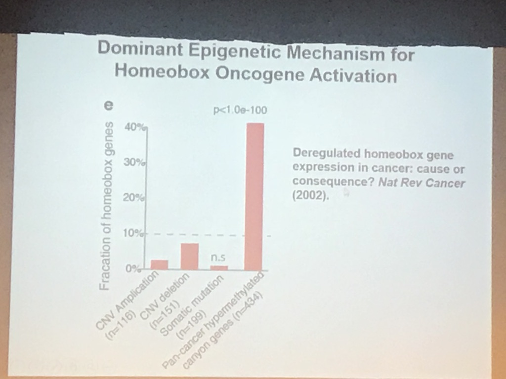

# R_MAC_CJ

r-cj
=====

R-cj
-----

This is the MAC_CJ R studio working directory

Pass my Ph.D. defense.
Something wrong with GitHub

> try to use vs code to combine github.

## First try readme

~liuchunjie~
**liuchunjie**
*liuchunjie*

### Hello world

## Second part

liuchunjie 

[open baidu](http://www.baidu.com)

[I'm a reference-style link][a]

Markdown | Less | Pretty
--- | --- | ---
*Still* | `renders` | **nicely**
1 | 23 | 4askhdlkh

liuchunje
liuchunjie

[a]: https://www.mozilla.org